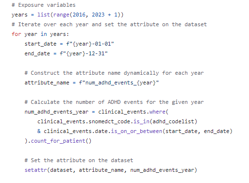

# Your Challenge, should you choose to accept it
Using your new-found, amazing, skills using ehrQL to query primary care data you have been assigned a task:

The Euros are on!
However, health officials are concerned about rising cases of alcohol abuse, and injuries due to excessive alcohol consumption.

Using your knowledge of ehrQL, probe primary care records to find out if there's a difference between the data for this year compared to last year.

This is an open ended task and so it's completely up to you what aspect you might try to dig into.

## What codelists might you use?
Have a look and see what you can find on opencodelists that might be relevant

Some you might consider are
- https://www.opencodelists.org/codelist/nhsd-primary-care-domain-refsets/alcadv_cod/20200812/
- https://www.opencodelists.org/codelist/nhsd-primary-care-domain-refsets/alcoholint_cod/20200812/
- https://www.opencodelists.org/codelist/nhsd-primary-care-domain-refsets/excessalc_cod/20200812/
- https://www.opencodelists.org/codelist/nhsd-primary-care-domain-refsets/alcref_cod/20200812/

Codelists found on OpenCodelists have been compiled for research purposes and so are not a complete set of all possible codelists. You can quickly create an adhoc codelist by hardcoding them into your dataset_definition file, like below:

**asthma_codes = ["39113311000001107", "39113611000001102"]**

## Expansion

Once you've managed to create a simple comparison between years, try to consider other aspects.

- Is there a difference when you consider sex?
- What about age?
- IMD quint/decile
- Ethnicity
- Can you combine any of these factors?
- What about last time there was a large football tournament on? How do our current figures compare?

## OS commands

To find out more about what you can run in the command line, run "opensafely"

The necessary commands are below:

- opensafely codelists update
- opensafely run run_all
- opensafely run run_all -f
- opensafely run {name_of_action}
- opensafely unzip output

## How can I compare two years of data?

There are two ways - up to you which one you choose, or maybe you can figure out another!

The first way is to create two dataset_definition files, with a starting and end date for each year.
Then, in the project.yaml create two different actions to run each of the files. Make sure you label the output correctly.
You will then have two csv files you can import to create your graph. You will need to wrangle them in order to obtain the output you are looking for.

The second option can be done in one dataset_definition file, and can be seen below in the image. You would provide a list of years, and for each year, in a loop, set an attribute to the dataset. This might be slightly more complicated, but will be easier to edit, and your data will always be in one output csv.

# Disclaimer
Because we are using dummy data, you may not pull out anything interesting, because it's not real. That's okay, because the point of the exercise is to learn how ehrQL works for when you do get the chance to use real patient data.